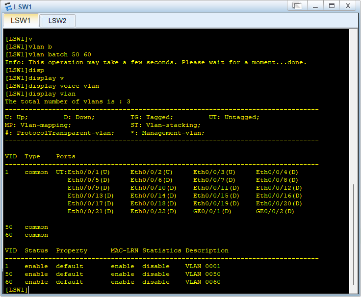
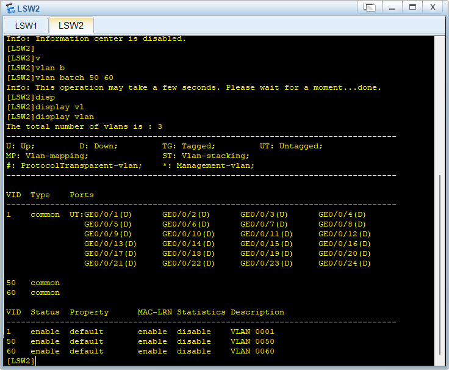
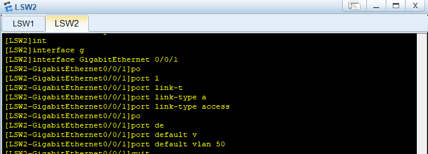
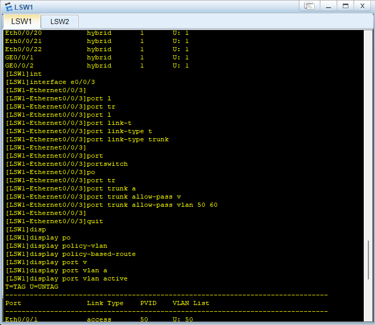
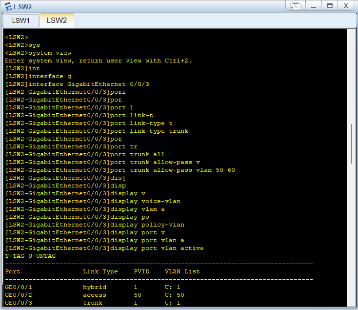
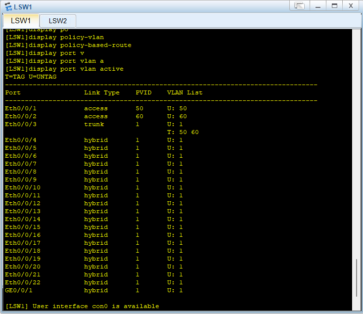
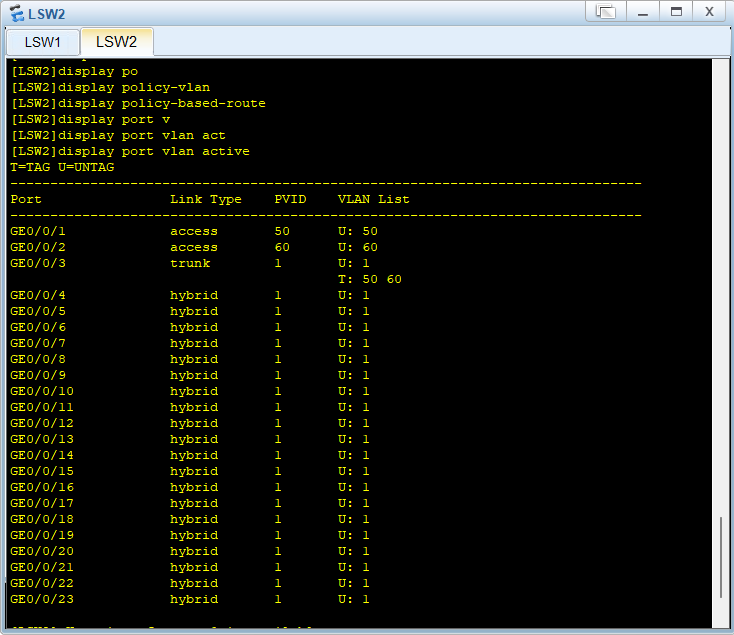
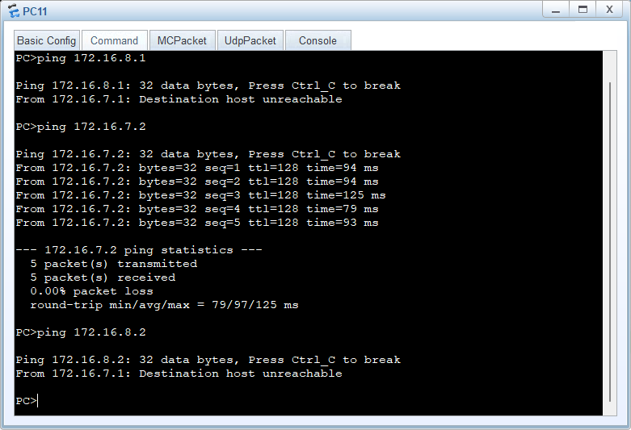

## 组号：

组长学号：f24011422                 姓名：侯宇轩

学号：f24011414                         姓名：陈海瑞

学号：f24011437                         姓名：徐颂磊

学号：f24011435                         姓名：王君唯

学号：f24011418                         姓名：范广哲

学号：f24011431                         姓名：孙明昊

# 一.实验过程

**（请描述过程并附上截图）**

## 1 配置、状态检查及测试过程

#### 1.配置设备名

配置LSW1和LSW2的主机名分别为LSW1、LSW2

#### 2.创建VLAN

分别创建多个VLAN 50 60

#### 3.access接口配置

分别配置LSW1的Ethernet 0/0/1的vlanid为50，0/0/2为60，link-type为access

分别配置LSW2的GigabitEthernet 0/0/1的vlanid为50，0/0/2为60，link-type为access

#### 4.trunk端口配置

分别配置LSW1的Ethernet 0/0/3的vlanid为50 60，link-type为trunk

分别配置LSW2的GigabitEthernet 0/0/3的vlanid为50 60，link-type为trunk

## 2 最终状态检查

分别在LSW1和LSW2中输入display port vlan active进行测试

## 3 最终测试结果

经测试，只有同部门电脑可以相互连接

抓包测试也可以抓取到数据

# 二.实验总结

#### 侯宇轩

​        本次网络交换机 VLAN 配置实验，让我对网络分层架构和 VLAN 技术有了更深入的实践认知，也切实提升了我的网络配置操作能力。

​        在实验收获方面，我不仅熟练掌握了交换机主机名配置、VLAN 创建、接口模式设置以及 Trunk 链路配置等核心操作，更深刻理解了 VLAN 技术隔离不同部门网络的原理。当成功实现技术部 PC11 与 PC12、市场部 PC21 与 PC22 内部互通，且两部门之间无法直接访问时，我清晰感受到 VLAN 在保障网络安全和提升网络效率中的关键作用，也对理论知识与实践操作的结合有了更直观的体会。

​        实验过程中，我也遇到了一些问题。比如在配置 Trunk 模式后，不同交换机上同 VLAN 的 PC 无法互通。起初我以为是 VLAN 划分错误，反复检查后发现是 Trunk 链路未正确允许对应 VLAN 通过。通过查阅《深入浅出计算机网络》和华为交换机配置手册，我重新配置了 Trunk 链路的 VLAN 允许列表，最终解决了问题。

​        不过，实验中也暴露出我的不足。在排查故障时，我缺乏系统的思路，浪费了较多时间；而且对交换机的高级配置功能了解较少，比如 VLAN 间路由等。未来我会加强网络故障排查方法的学习，同时深入研究交换机的高级功能，提升自己的网络技术水平。

#### 王君唯

在完成这次网络规划实验后，我深刻体会到了网络配置的复杂性和重要性。通过配置LSW1和LSW2交换机的VLAN，我学会了如何确保不同部门的网络隔离，同时保证同一部门内部的通信。实验中，我成功地让技术部的PC11和PC12能够互相访问，市场部的PC21和PC22也能够互相访问，但两个部门之间无法直接访问，这验证了VLAN划分的有效性。

然而，实验过程中也遇到了一些挑战。例如，在配置Trunk模式时，我最初没有正确设置允许通过的VLAN，导致部门间的通信出现了问题。通过查阅相关文献和网络资源，我了解到Trunk端口需要明确指定允许通过的VLAN，以确保正确的网络隔离。

此外，我还学习了如何保存配置，这对于网络管理至关重要。通过这次实验，我不仅巩固了理论知识，还提高了实际操作能力。未来，我计划进一步学习高级网络配置技术，以应对更复杂的网络环境。这次实验是一个很好的起点，我将继续探索网络技术，以提升我的专业技能。

#### 徐颂磊

独自完成本次VLAN配置实验，我收获的不仅是技术的提升，更是独立解决问题能力的锻炼。

实验初期，我对照拓扑图梳理配置逻辑，从设置交换机主机名，到创建VLAN、将接口划入对应VLAN，每一步都严格按命令格式操作。但在配置跨交换机通信时，同VLAN终端始终无法互通。我通过逐行核对命令，最终发现是trunk接口未正确配置“allow-pass vlan”参数，遗漏了允许通信的VLAN ID。

这次排障让我深刻认识到，网络配置需极度严谨，一个参数的疏忽就会导致整体故障。通过反复测试，问题解决的瞬间，我对VLAN隔离与跨设备通信的原理理解更透彻了。

独自操作的过程中，我学会了冷静分析问题、系统排查故障，也懂得了借助技术文档解决难题。这次实验让我明白，理论知识只有结合实践才能真正掌握，而独立实践的经历，更让我积累了宝贵的排障经验，为后续学习筑牢了基础。

#### 陈海瑞

在本次公司网络规划实验中，我收获颇丰。通过配置交换机实现 VLAN 划分，我深入理解了不同部门间网络隔离与互通原理，熟练掌握了交换机主机名设置、VLAN 添加、接口模式配置等操作，提升了网络规划与实操能力。

实验中，我也遇到不少问题，如 Trunk 模式配置时对允许通过 VLAN 的理解偏差，导致初期部门间无法按预期通信。通过查阅《华为交换机配置指南》等文献，反复调试才解决。

不足在于对命令细节把握不够精准，配置效率有待提高。未来我会加强理论学习，多参与实践项目，积累经验，提升故障排查与解决能力，为今后实际工作筑牢基础。

#### 范广哲

本次交换机VLAN配置实验，让我对“逻辑隔离”与“跨设备通信”的网络设计有了实操认知。从配置主机名、创建VLAN，到将接入接口设为access模式划分部门网络，再到配置Trunk接口实现跨交换机同VLAN互通，每一步都紧密关联实验目标。

过程中我深刻体会到命令准确性的重要性，曾因误将Trunk接口设为access模式，导致交换机同部门PC无法连通，通过 display 系列命令排查后成功解决。这不仅强化了我对VLAN和Trunk核心原理的理解，也让我学会了从接口模式、VLAN划分、Trunk允许列表三个维度快速排错，为后续复杂网络配置打下了坚实基础。

#### 孙明昊

本次实验让我对交换机VLAN配置有了清晰认知，熟练掌握了在设备上创建VLAN、设置接口Access和Trunk模式等操作，也明白同VLAN内主机能通信、不同VLAN隔离的原理，对企业网络划分有了更实际的理解。

不足

配置过程中，对部分命令的记忆不够准确，比如在设置Trunk接口允许通过的VLAN时，曾因忘记完整命令格式而卡顿，操作流畅度还有提升空间。

碰到的问题

在配置LSW1的Ethernet0/0/3接口为Trunk模式时，起初没成功让VLAN50和60的数据通过，后来检查发现是 port trunk allow-pass vlan 命令后VLAN范围设置有误。另外，对不同接口模式的适用场景，在实际配置时还需多思考确认。

查看的文献

参考了《华为交换机配置指南》中关于VLAN和接口模式配置的章节，也查阅了《计算机网络实验教程》里有关交换机VLAN划分与通信测试的内容。

# 三.思考题

1.vlan的作用是什么？

 **网络隔离**：VLAN可以将一个物理网络划分为多个逻辑上的网络，使得不同VLAN之间的设备不能直接通信，从而提高网络的安全性和减少广播流量。

**提高安全性**：通过将敏感设备或数据隔离在特定的VLAN中，可以防止未授权的访问。

**网络管理**：VLAN简化了网络管理，使得可以根据部门、项目或功能轻松地组织网络资源。

**性能优化**：通过减少不必要的广播和流量，VLAN可以提高网络性能。

**灵活性和可扩展性**：VLAN提供了网络设计的灵活性，允许在不改变物理连接的情况下重新配置网络。

2.vlan的配置流程是怎样的？

**规划VLAN**：根据组织结构或功能需求规划VLAN，确定每个VLAN的名称和编号。

**创建VLAN**：在交换机上创建VLAN，并为每个VLAN分配一个唯一的ID。

**分配端口到VLAN**：将交换机的端口分配给相应的VLAN，这些端口可以是接入端口（Access端口）或中继端口（Trunk端口）。

**配置Trunk端口**：如果需要在交换机之间传输多个VLAN的数据，需要配置Trunk端口，并指定允许通过的VLAN。

**配置路由**：如果VLAN之间需要通信，需要配置路由器或三层交换机来实现VLAN间的路由。

**测试和验证**：配置完成后，需要测试网络连接，确保VLAN配置正确，网络隔离和通信按预期工作。

**保存配置**：将配置保存到交换机上，以防止重启后配置丢失。

3.access、trunk接口转发帧的过程是怎样的？

**Access接口**：

Access接口通常连接到单个VLAN的设备，如工作站或服务器。

当设备发送帧时，Access接口会将该帧标记为属于其VLAN。

接收到帧后，Access接口会去除VLAN标记，并将帧传递给连接的设备。

Access接口不会转发标记为其他VLAN的帧，从而实现VLAN隔离。

**Trunk接口**：

Trunk接口用于在交换机之间或交换机与路由器之间传输多个VLAN的数据。

当发送帧时，Trunk接口会保留VLAN标记，这样接收的交换机就知道该帧属于哪个VLAN。

接收到帧后，Trunk接口会根据VLAN标记将帧传递到正确的VLAN。

Trunk接口需要配置允许通过的VLAN列表，以确保只有授权的VLAN流量可以通过。